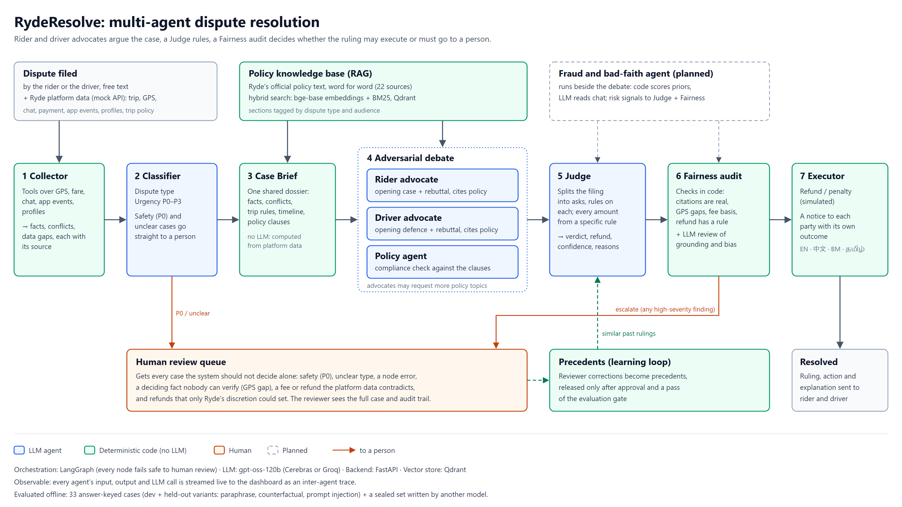

# RydeResolve-Agent

> Multi-Agent System for Automated Dispute Resolution on the Ryde Platform
>
> **Competition**: Tencent Cloud AI CAN DO IT Hackathon Singapore 2026 — Digital Native Track (Ryde)
>
> **Prize Pool**: SGD $17,000 (1st: $10,000 / 2nd: $5,000 / 3rd: $2,000)
>
> **Challenge**: Multi-Agent Autonomous Dispute Resolution System
>
> **Deadline**: 16 October 2026 | **Demo Day**: 3 November 2026
>
> **Built with**: CodeBuddy (Tencent Cloud AI coding assistant)

## Overview

RydeResolve-Agent settles ride disputes on **Ryde**, Singapore's first real-time carpooling
platform, using a pipeline of cooperating agents. A Rider Advocate and a Driver Advocate each build
their side's case from platform evidence and official Ryde policy, then rebut each other. A Judge
rules on every ask, with a confidence score and reasons. Code checks and a Fairness review decide
whether the ruling is executed automatically or sent to a person. Every step is traced and
visible live.

**Status (2026-10-07):** the pipeline includes Fraud and the D21/D22 chat safeguards.
The latest full evaluation (D20, Cerebras `gpt-oss-120b`) matched **35/37 verdicts (94.6%)**
and 27/29 refund amounts. It resumed 14 cases after a daily-quota reset. Both incorrect
no-show rulings went to human review; this is evaluation accuracy, not an automatic resolution
rate. D21/D22 checks were targeted, and the latest code still needs a new full live evaluation.

## Background

### About Ryde

[Ryde Technologies Pte. Ltd.](https://www.rydesharing.com) is a Singapore-based mobility platform offering:

| Service | Description |
|--------|-------------|
| Ride-hailing | Private car services with instant & advance booking |
| Delivery | Point-to-point on-demand delivery (RydeSEND) |
| Carpooling | Shared rides, eco-friendly travel — Ryde's flagship differentiator |

**Key business differentiators**:
- **0% commission for drivers** (vs Grab/Gojek)
- **Ryde+ subscription** for passengers (unlimited cashback, priority matching)
- Corporate & merchant solutions

### Problem

As a multi-sided platform connecting passengers, drivers, merchants, and corporate clients, Ryde faces significant dispute volume across fare, cancellation, service quality, delivery, driver rights, and accident liability categories. Current manual customer service is slow, inconsistent, and costly.

## Architecture



Vector source: [`docs/architecture.svg`](docs/architecture.svg).

### Core Agents

| Agent | Role |
|-------|------|
| **Collector** | Deterministic tools over platform data (GPS, fare, chat, app events, profiles) produce facts, conflicts and data gaps, each with its source |
| **Classifier** | Dispute type and urgency (P0-P3); safety and unclear cases go straight to a person |
| **Case Brief** | One shared dossier (no LLM): facts, conflicts, the trip's rules, timeline and retrieved policy clauses |
| **Rider / Driver advocates** | Each builds its side's case from the brief and cites policy, then rebuts the other |
| **Fraud** | Deterministic risk signals and evidence-grounded chat labels; threats route separately to safety review |
| **Policy** | Compliance check of both cases against the retrieved official Ryde policy (RAG) |
| **Judge** | Splits the filing into asks, rules on each with amounts from specific rules, gives confidence and reasons; sees approved precedents |
| **Fairness** | Code checks (real citations, GPS gaps, fee basis, refund basis) plus an LLM grounding/bias review; any high-severity finding sends the case to a person |
| **Executor** | Simulated refund / penalty and a notice to each party with its own outcome (EN/ZH/MS/TA) |

### Key Innovations

1. **Adversarial debate on shared facts.** Both advocates argue from the same Case Brief (facts,
   conflicts and data gaps found by deterministic tools), then rebut each other. `MAX_DEBATE_ROUNDS`
   sets the number of rounds (default 1).
2. **Rulings per ask, amounts from rules.** The Judge splits a filing into its separate asks and
   takes every amount from a specific policy rule applied to a specific figure.
3. **Policy anchoring with verified citations.** Rulings may only cite clauses that retrieval
   actually returned from the official Ryde policy texts. Invalid citations are caught in code.
4. **Safe by default.** Safety cases, missing data, contradicted payouts, discretionary refunds and
   high-severity fairness findings go to a person instead of being executed.
5. **Learning with a human in the loop.** Reviewers approve or correct rulings, and only approved
   rulings become precedents the Judge can see. Risk flags count only after a person confirms them.
6. **Full audit trail.** A live trace of every agent step and LLM call, rulings stored in a database,
   and an append-only, hash-chained audit log (`GET /api/audit/verify`).

## Tech Stack

| Layer | Technology |
|-------|-----------|
| Orchestration | LangGraph state graph (`src/core/workflow.py`) |
| LLM | `LLM_PROVIDER`: Groq or Cerebras (`gpt-oss-120b`), Google Gemini, or Tencent Hunyuan (TokenHub). `LLM_FALLBACK_PROVIDERS` tries backups in order |
| Policy retrieval | Qdrant Cloud hybrid search (dense `bge-base-en-v1.5` + BM25 via fastembed, RRF fusion; collection `ryde_policies_official`); local ChromaDB as an alternative |
| Tencent Cloud | ADP (Agent Development Platform) policy assistant on Hunyuan hy3, built over the same official policy files (`scripts/adp/`) |
| Records | SQLAlchemy store: SQLite locally, Postgres (Supabase) via `STORE_URL` / `DATABASE_URL` |
| Backend | Python + FastAPI, live trace streamed over server-sent events |
| Frontend | Single-page dashboard (`frontend/index.html`, plain JS): file a dispute, watch the agents, read the ruling and both notices |
| Tests | pytest (offline, no real model calls) |
| Containers | Dockerfile + docker-compose |

## Dispute Categories

Covered end to end with labelled test cases: **fare disputes**, **route deviation**, **no-show
charges**, **cancellation and refunds**, **cleaning fees**, **service quality** (conduct
complaints) and **driver rights**. Safety incidents are classified P0 and always go to a person.

## Quick Start

```bash
python -m pip install -r requirements.txt
# create .env with the variables below
python -m uvicorn src.api.main:app --host 127.0.0.1 --port 8000
# Open http://127.0.0.1:8000 in your browser
```

On Windows, run `./Start-Ryde.ps1` in PowerShell to check dependencies, open the dashboard,
and start the API. Use `./Start-Ryde.ps1 -Port 8001` if the old server occupies port 8000.
The terminal must remain open. Do not use CMD's `start "" ...` syntax in PowerShell.

The dashboard and API share an origin. `/api/health` reports process liveness;
`/api/readiness` separately checks model-key configuration, record connectivity and policy
collection/model dimensions. It does not verify live quota or model quality.

An optional untracked `.env.local` overrides `.env` for this machine (explicit process
variables take precedence). For an isolated local demo with the existing official Qdrant index:

```dotenv
STORE_URL=sqlite:///data/ryde_resolve.local.db
QDRANT_COLLECTION=ryde_policies_official
QDRANT_DENSE_MODEL=BAAI/bge-base-en-v1.5
POLICIES_DIR=data/policies/official
MAX_DEBATE_ROUNDS=1
```

This local record database is separate from the shared store; it does not import shared
history. Set STORE_URL explicitly to reconnect to the shared store after connectivity is fixed.
The local Groq smoke run exceeded this account's 8,000-token single-request capacity with
three debate rounds (8,927 requested). The local profile uses the project default of one
round; this is a demo configuration change, not a new full-evaluation accuracy claim.
Only select an existing Qdrant collection indexed with the same embedding model; do not rebuild
any shared collection to start the demo.

Before remote access, configure distinct `API_DEMO_KEY` and `API_ADMIN_KEY` secrets and HTTPS.
With keys configured, the dashboard asks for an access code and keeps it only in memory.
Demo access can run cases; uploads, deletions, reviews, precedents, flags and audit/history
administration require the admin key. Audit actor names come from the authenticated role.
Without keys, API access is limited to loopback clients and hosts, with origin checks.
The API permits one dispute run at a time and cancels further work after a stream disconnect;
an already-sent provider request can still complete and be billed.

The shared `ryde_policies_official` collection is read-only through the upload/delete API
unless `ALLOW_POLICY_MUTATIONS=1` is explicitly set. Use a separate collection for uploaded
documents; evidence files never enter the policy index. Uploads accept at most 5 files,
10 MB per file, with generated storage names and bounded multipart request bodies.
The container keeps policy/case files in the image and mounts only writable data directories.
If using SQLite in Docker, set `STORE_URL=sqlite:///data/records/ryde_resolve.db` to use its
record volume. The default compose store is Postgres; a clean container build is still required.

Main `.env` variables:

| Variable | Purpose |
|----------|---------|
| `LLM_PROVIDER` | `groq`, `cerebras`, `gemini` or `hunyuan` |
| `LLM_FALLBACK_PROVIDERS` | Backup providers tried in order, e.g. `cerebras,gemini` |
| `GROQ_API_KEY`, `CEREBRAS_API_KEY`, `LLM_API_KEY` (Gemini), `HUNYUAN_API_KEY` | Provider keys |
| `LLM_SPEND_CAP_USD` | Per-process spend cap for the paid Cerebras credit (default 1.00) |
| `VECTOR_BACKEND`, `QDRANT_URL`, `QDRANT_API_KEY`, `QDRANT_COLLECTION`, `QDRANT_DENSE_MODEL`, `POLICIES_DIR` | Policy index (`qdrant` or `chroma`); the team uses `ryde_policies_official`, `BAAI/bge-base-en-v1.5`, `data/policies/official` |
| `STORE_URL` / `DATABASE_URL` | Records database (default: local SQLite) |
| `MAX_DEBATE_ROUNDS` | Debate rounds (default 1) |

## Evaluation

```bash
LLM_PROVIDER=cerebras python scripts/eval.py --yes        # all labelled cases
python scripts/eval.py --cases FD-002,NS-001 --repeat 3     # chosen cases, stability check
python scripts/eval.py --resume data/eval/<run>             # continue a stopped run
python -m pytest -q                                         # offline unit tests
```

Each run writes `data/eval/<timestamp>/report.html`, `results.csv` and one trace per case. Evals
never use fallback providers, so a run never mixes models. Latest full run (20261005-171730, D20):

| Metric | Result |
|--------|--------|
| Verdict accuracy | 35/37 (94.6%); two wrong no-show proposals routed to human review |
| Refund amount accuracy | 27/29 |
| Classification accuracy | 31/31 |
| Refund cap respected / citation validity | 100% |
| Retrieval Hit@3 | 36/37 |
| Failed runs | 0 after resuming 14 cases when daily quota reset |
| Cost | US$0.42 total; 983k tokens |

A sealed case set (`data/eval_cases/sealed`) is run once, just before submission. It checks that
the prompt changes made on these labelled cases generalise. The evaluation design, every change and its
measured effect are in `docs/06_EVAL_PLAN.md` and `docs/08_DESIGN_DECISIONS.md`.

## Project Structure

```
RydeResolve-Agent/
├── src/
│   ├── agents/        # collector (+ collector_tools), classifier, case_brief, passenger, driver,
│   │                  # policy, arbitrator (Judge), fairness, executor
│   ├── core/          # workflow (LangGraph), debate, llm_client, trace, policy_refs, confidence
│   ├── rag/           # indexer, retriever, Qdrant hybrid search, policy topics, precedents
│   ├── store/         # records DB, audit chain, feedback/precedents, rider/driver history
│   ├── integrations/  # simulated Ryde platform API (integration contract)
│   ├── api/           # FastAPI service
│   └── config.py
├── frontend/          # dashboard: index.html, dispute.js, dispute.css
├── data/
│   ├── policies/official/   # verbatim official Ryde policy texts (retrieval source)
│   ├── mock_disputes/       # demo disputes with platform data
│   ├── eval_cases/          # held-out, sealed and fraud case sets
│   └── eval_answer_keys.json
├── scripts/           # eval, index_policies, adp/ (Tencent ADP), migrate_store, seed_people, ...
├── tests/             # pytest suite
├── docs/              # requirements, development log, eval plan, design decisions, architecture
└── proof of usage of codebuddy/   # CodeBuddy development screenshots
```

## Documentation

| Document | Contents |
|----------|----------|
| [docs/01_PROJECT_REQUIREMENTS.md](docs/01_PROJECT_REQUIREMENTS.md) | Competition brief and what it requires |
| [docs/03_DEVELOPMENT_LOG.md](docs/03_DEVELOPMENT_LOG.md) | Dated development log and current handoff |
| [docs/05_NEXT_STEPS.md](docs/05_NEXT_STEPS.md) | Remaining work before submission |
| [docs/06_EVAL_PLAN.md](docs/06_EVAL_PLAN.md) | How the architecture is evaluated |
| [docs/08_DESIGN_DECISIONS.md](docs/08_DESIGN_DECISIONS.md) | Every design change with its measured effect (D1–D22) |
| [docs/09_FRAUD_AGENT_DESIGN.md](docs/09_FRAUD_AGENT_DESIGN.md) | Fraud and bad-faith detection design |

## License

MIT
